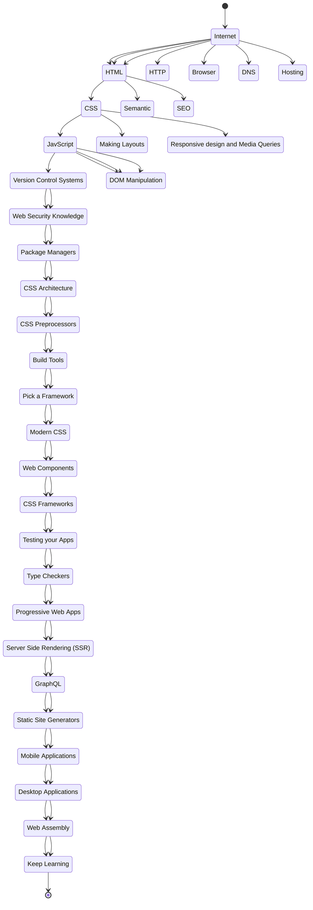

# 프론트 엔드 로드맵

```mermaid
stateDiagram
    [*] --> Internet

    Internet --> HTML
    HTML --> CSS
    CSS --> JavScript
    JavScript --> Version&nbsp;Control&nbsp;Systems
    Version&nbsp;Control&nbsp;Systems --> Web&nbsp;Security&nbsp;Knowledge
    Web&nbsp;Security&nbsp;Knowledge --> Package&nbsp;Managers
    Package&nbsp;Managers --> CSS&nbsp;Architecture
    CSS&nbsp;Architecture --> CSS&nbsp;Preprocessors
    CSS&nbsp;Preprocessors --> Build&nbsp;Tools
    Build&nbsp;Tools --> Pick&nbsp;a&nbsp;Framework
    Pick&nbsp;a&nbsp;Framework --> Modern&nbsp;CSS
    Modern&nbsp;CSS --> Web&nbsp;Components
    Web&nbsp;Components --> CSS&nbsp;Frameworks
    CSS&nbsp;Frameworks --> Testing&nbsp;your&nbsp;Apps
    Testing&nbsp;your&nbsp;Apps --> Type&nbsp;Checkers
    Type&nbsp;Checkers --> Progressive&nbsp;Web&nbsp;Apps
    Progressive&nbsp;Web&nbsp;Apps --> Server&nbsp;Side&nbsp;Rendering&nbsp;(SSR)
    Server&nbsp;Side&nbsp;Rendering&nbsp;(SSR) --> GraphQL
    GraphQL --> Static&nbsp;Site&nbsp;Generators
    Static&nbsp;Site&nbsp;Generators --> Mobile&nbsp;Applications
    Mobile&nbsp;Applications --> Desktop&nbsp;Applications
    Desktop&nbsp;Applications --> Web&nbsp;Assembly
    Web&nbsp;Assembly --> Keep&nbsp;Learning

    Keep&nbsp;Learning --> [*]

    Internet --> HTTP
    Internet --> Browser
    Internet --> DNS
    Internet --> Hosting
    Internet --> HTML
    Internet --> HTML
    HTML --> Semantic HTML
    HTML --> SEO
    CSS --> Making&nbsp;Layouts
    CSS --> Responsive&nbsp;design&nbsp;and&nbsp;Media&nbsp;Queries
    JavScript --> DOM&nbsp;Manipulation
    JavScript --> DOM&nbsp;Manipulation
    JavScript --> DOM&nbsp;Manipulation
    Version&nbsp;Control&nbsp;Systems --> Web&nbsp;Security&nbsp;Knowledge
    Web&nbsp;Security&nbsp;Knowledge --> Package&nbsp;Managers
    Package&nbsp;Managers --> CSS&nbsp;Architecture
    CSS&nbsp;Architecture --> CSS&nbsp;Preprocessors
    CSS&nbsp;Preprocessors --> Build&nbsp;Tools
    Build&nbsp;Tools --> Pick&nbsp;a&nbsp;Framework
    Pick&nbsp;a&nbsp;Framework --> Modern&nbsp;CSS
    Modern&nbsp;CSS --> Web&nbsp;Components
    Web&nbsp;Components --> CSS&nbsp;Frameworks
    CSS&nbsp;Frameworks --> Testing&nbsp;your&nbsp;Apps
    Testing&nbsp;your&nbsp;Apps --> Type&nbsp;Checkers
    Type&nbsp;Checkers --> Progressive&nbsp;Web&nbsp;Apps
    Progressive&nbsp;Web&nbsp;Apps --> Server&nbsp;Side&nbsp;Rendering&nbsp;(SSR)
    Server&nbsp;Side&nbsp;Rendering&nbsp;(SSR) --> GraphQL
    GraphQL --> Static&nbsp;Site&nbsp;Generators
    Static&nbsp;Site&nbsp;Generators --> Mobile&nbsp;Applications
    Mobile&nbsp;Applications --> Desktop&nbsp;Applications
    Desktop&nbsp;Applications --> Web&nbsp;Assembly
    Web&nbsp;Assembly --> Keep&nbsp;Learning
```
